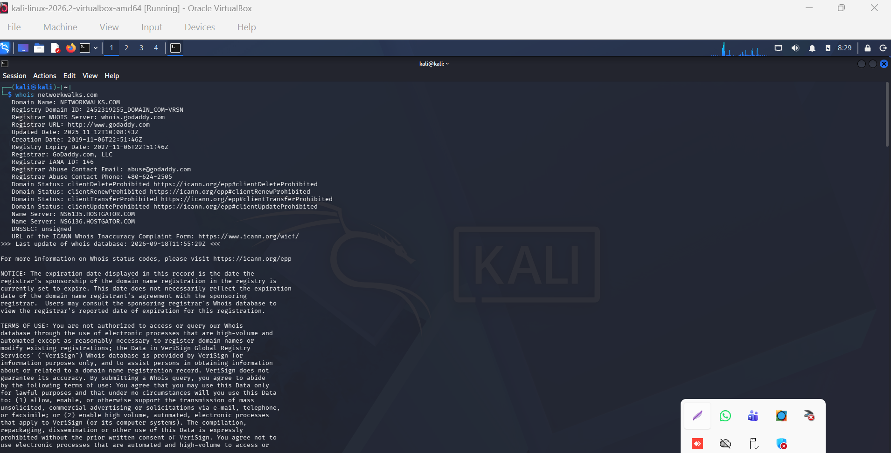
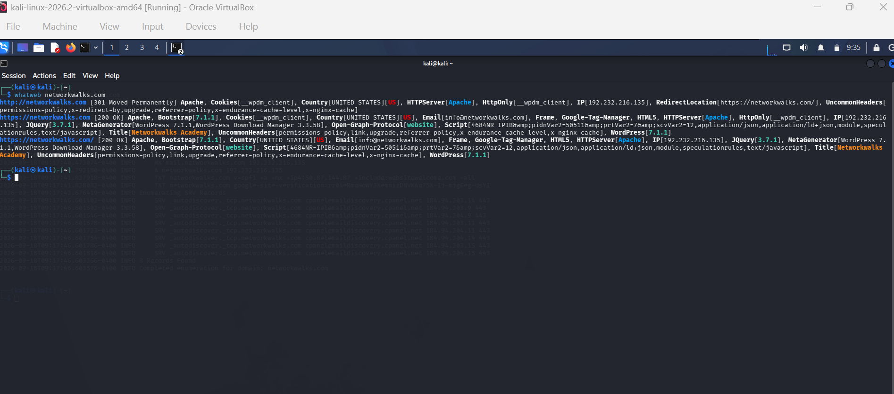
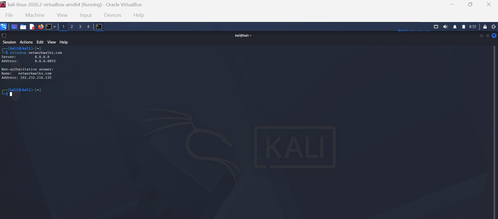
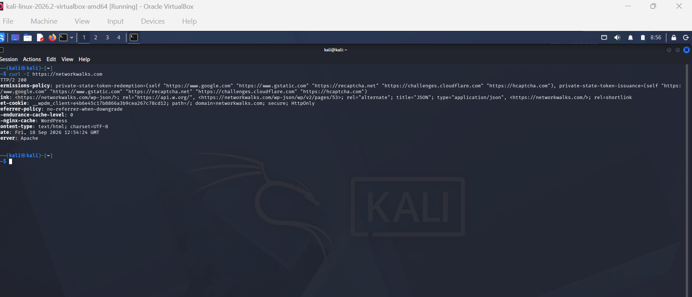
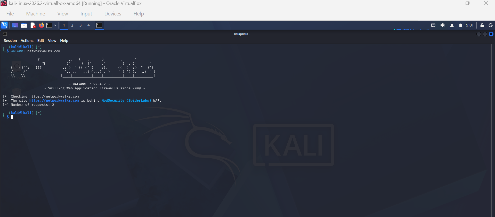
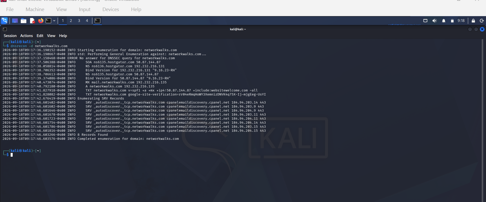
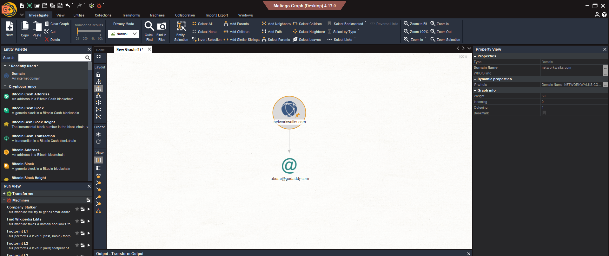
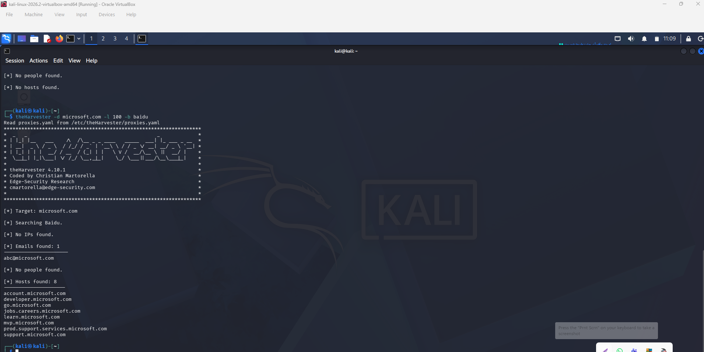

div align="center">

# 🔍 Week 2 - Footprinting, Scanning & Report Writing

**Building an isolated virtual lab for penetration testing and ethical hacking practice**

  
  
  
  
  
  
  
  
  
  
  
  

# W2-PM1: Footprintng with Multiple Kali Tools

# Task 1: Domain Registration Lookup (whois)
#Standard lookup

whois networkwalks.com

# Task 2: Web Technology Fingerprinting (whatweb)
whatweb identifies CMS platforms, web server daemons, programming languages, and JavaScript libraries.

# Task 3: DNS Name Resolution (nslookup)
nslookup queries DNS servers to resolve a domain name to its IP addresses.

nslookup networkwalks.com

# Task 4: HTTP Header & Endpoint Inspection (curl -I)
Sends an HTTP HEAD request to inspect response headers without downloading the page body.

curl -I https://networkwalks.com
curl -I https://example.com

# Task 5: Web Application Firewall Detection (wafw00f)
Detects whether a website sits behind a Web Application Firewall (WAF) and identifies the vendor.

wafw00f https://networkwalks.com
wafw00f https://example.com

# Task 6: Full DNS Record Enumeration (dnsrecon)
Automates the retrieval of all DNS record types (SOA, NS, MX, A, AAAA, TXT, SPF) in a single pass.

dnsrecon -d networkwalks.com -t std

 # W2-PM3: Maltego-based Footprinting Attacks
Workflow: Entity link analysis starting from domain networkwalks.com, executing transforms to discover DNS names, IP blocks, Netblocks, and organizational email addresses.

# W2-PM4: theHarvester-based Footprinting Attacks
theHarvester -d networkwalks.com -b all -l 100
Harvests public corporate emails, employee names, search engine subdomains, and public IP ranges.

# W2-PM5: Zenmap & Nmap Network Scanning (Essential)

